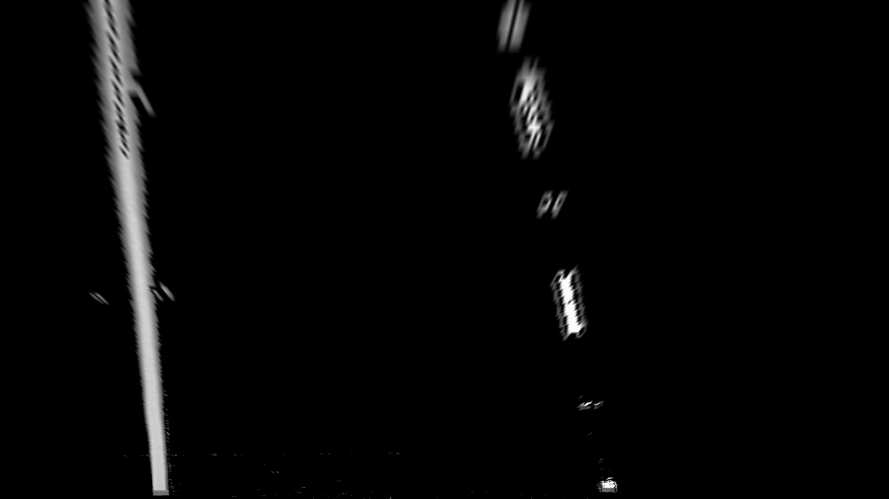

# Advanced Find Lane Line project


1. *result image*

## Introduction
> This is Advanced lane finding project of Udacity's Self-Driving Car Engineering Nanodegree. We already completed lane finding project in the first project. In that project, we could find lane lines and made robust algorighm for shadow and some of occlusion. It might be enough in the straight highway. But there are many curve lines in the road and that's why we need to detect curve lanes. In this project we'll find lane lines more specifically with computer vision.
## Environment
> MacOS Big Sur, Python 3.8.5, OpenCV 4.4.0.46
## Files
- [main.py](main.py) to do main work
- [image_processing.py](image_processing.py) to process the single image
- [video_processing.py](video_processing.py) to process the fideo file
## The goal / steps of this project are the following:
- Compute the camera calibration matrix and distortion coefficients given a set of chessboard images.
- Apply a distortion correction to raw images.
- Use color transforms, gradients, etc., to create a thresholded binary image.
- Apply a perspective transform to rectify a binary image ("birds-eye view").
- Detect lane pixels and fit to find the lane boundary.
- Determine the curvature of the lane and vehicle position with respect to center.
- Warp the detected lane boundaries back onto the original image.
- Output visual display of the lane boundaries and numerical estimation of lane curvature and vehicle position.

## Pipeline
- Load image
- Calibrate camera
- Perspective transform
- Convert given image to HSL image
- Isolate yellow and white color from HSL image
- Convert image to grayscale
- Select region of interest
- Trace region of interest and discard all other lines identified by our previous step
- Apply a perspective transform to rectify binary image
- Find lanes
- Draw segments of roads and road info

### 1. Load image
Load image from disk.


2. *given image*

### 2. Calibrate camera
Have the camera matrix and distortion coefficients been computed correctly and checked on one of the calibration images as a test?
The code for this step is contained in:
```
    def camera_calibration(cls, directory_name):
        calibration_pics_loc = os.listdir(directory_name)
        calibration_images = []

        for i in calibration_pics_loc:
            i = f'{directory_name}/{i}'
            image = cv2.imread(i)
            calibration_images.append(image)

        # Prepare object points
        objp = np.zeros((6 * 9, 3), np.float32)
        objp[:, :2] = np.mgrid[0:9, 0:6].T.reshape(-1, 2)

        # Arrays for later storing object points and image points
        objpoints = []
        imgpoints = []

        for image in calibration_images:

            gray = cv2.cvtColor(image, cv2.COLOR_BGR2GRAY)

            ret, corners = cv2.findChessboardCorners(gray, (9, 6), None)

            if ret == True:
                objpoints.append(objp)
                imgpoints.append(corners)

                cv2.drawChessboardCorners(image, (9, 6), corners, ret)

        # Get undistortion info and undistort
        ret, mtx, dist, rvecs, tvecs = cv2.calibrateCamera(objpoints, imgpoints, gray.shape[::-1], None, None)

        return mtx, dist
```
This script loads calibration images of chessboards taken at different angles. Each image is grayscaled and sent into cv2.drawChessboardCorners. The resulting "objpoints" are the (x, y, z) coordinates of the chessboard corners in the world.

Finally the corner points are sent to cv2.calibrateCamera to get resulting image points and object points. This dictionary is then saved for reuse in undistorted other images in the pipeline.

### 3. Perspective transform
Perspective Transform is a feature that is very useful if you want to align the image properly . It transforms the image in a straight manner after Perspective Transformation is applied to it.
We can assume the road is a flat plane. We take 4 points of straight of lane lines and put to respective transform function. As a result we get Bird's eye view.


3. *undistorted image*

### 4. Convert given image to HSL image
How does it look like when images are converted from RGB to HSL color space?


4. *HLS image*

### 5. Isolate yellow and white color from HSL image
Let’s build a filter to select those white and yellow lines. I want to select particular range of each channels (Hue, Saturation and Light).

Both the white and yellow lines are clearly recognizable.


5. *Isolated image*

### 6. Convert image to grayscale
The images should be converted into gray scaled ones in order to transform to binary image.
Here, I’m converting the white and yellow line images from the above into gray scale for edge detection.


6. *Gray Scale image*

### 7. Select region of interest
In case of finding lane lines, it might make sense to apply operations only to a portion of an image. Thus, it is important to extract a region of interest of an original image.


7. Region of Interest image

### 8. Trace region of interest and discard all other lines identified by our previous step


8. *Selected image*

### 9. Apply a perspective transform to rectify binary image
Given the thresholded binary image, the next step is to perform a perspective transform. The goal is to transform the image such that we get a "bird's eye view" of the lane, which enables us to fit a curved line to the lane lines (e.g. polynomial fit). Another thing this accomplishes is to "crop" an area of the original image that is most likely to have the lane line pixels.

To accomplish the perspective transform, I use OpenCV's getPerspectiveTransform() and warpPerspective() functions. I hard-code the source and destination points for the perspective transform. The source and destination points were visually determined by manual inspection, although an important enhancement would be to algorithmically determine these points.

9. *Warped image*

### 10. Find lanes
Given the warped binary image from the previous step, I now fit a 2nd order polynomial to both left and right lane lines. In particular, I perform the following:

Calculate a histogram of the bottom half of the image
Partition the image into 9 horizontal slices
Starting from the bottom slice, enclose a 200 pixel wide window around the left peak and right peak of the histogram (split the histogram in half vertically)
Go up the horizontal window slices to find pixels that are likely to be part of the left and right lanes, recentering the sliding windows opportunistically
Given 2 groups of pixels (left and right lane line candidate pixels), fit a 2nd order polynomial to each group, which represents the estimated left and right lane lines
### 11. Draw segments of roads and road info


10. *Result image*

# Conclusion
This is an initial version of advanced computer-vision-based lane finding. There are multiple scenarios where this lane finder would not work. For example, the Udacity challenge video includes roads with cracks which could be mistaken as lane lines (see 'challenge_video.mp4'). Also, it is possible that other vehicles in front would trick the lane finder into thinking it was part of the lane. More work can be done to make the lane detector more robust, e.g. deep-learning-based semantic segmentation to find pixels that are likely to be lane markers (then performing polyfit on only those pixels)
